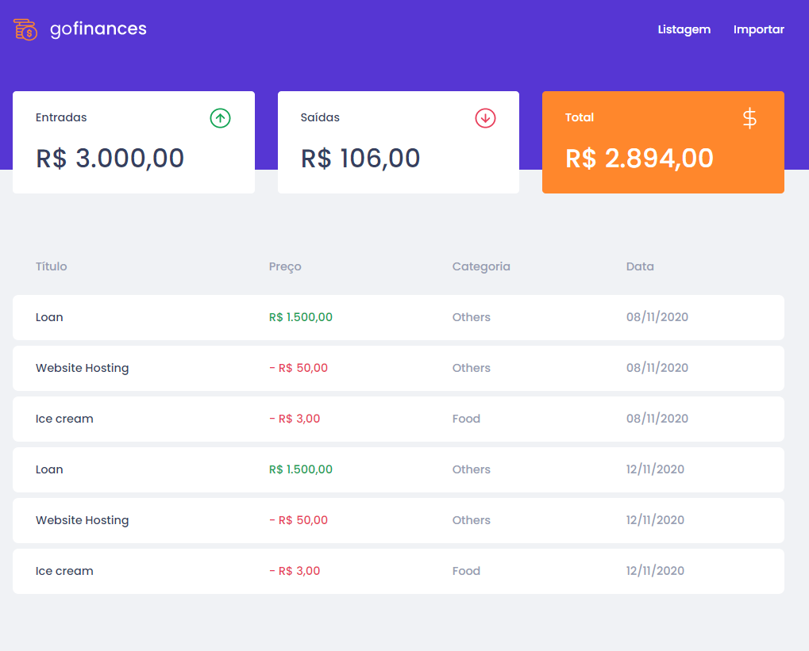
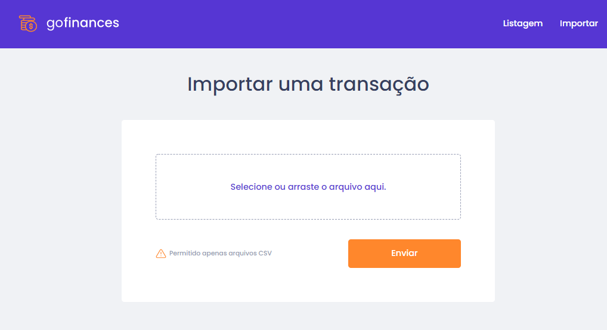
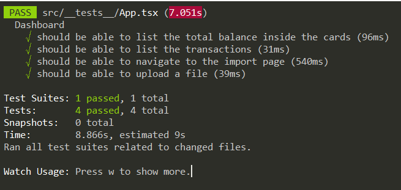

  <a href="#rocket-tecnologias">Tecnologias</a>&nbsp;&nbsp;&nbsp;|&nbsp;&nbsp;&nbsp;
  <a href="#-projeto">Projeto</a>&nbsp;&nbsp;&nbsp;|&nbsp;&nbsp;&nbsp;
  <a href="#-como-rodar">Como rodar</a>&nbsp;&nbsp;&nbsp;|&nbsp;&nbsp;&nbsp;
  <a href="#-como-contribuir">Como contribuir</a>&nbsp;&nbsp;&nbsp;
  

 

  

  

## GoStack - Sexto desafio React

## 🚀 Tecnologias

Esse projeto foi desenvolvido com as seguintes tecnologias:

- [React](https://pt-br.reactjs.org/docs/getting-started.html)
- [Yarn](https://yarnpkg.com/) - 1.22.4
- [Npm](https://www.npmjs.com/) - 6.14.5

## 💻 Projeto

Site que consume a API do desafio anterior. No dashboard lista todas as transações(separa por cor o tipo outcome e income) e mostra o balance.
Na pagina de importar é possivel importar um aquivo SVG (aquivo de exemplo está na raiz do projeto, file.csv).

Link do [desafio anterior](https://github.com/jamangueira7/template-challenge-5-gostack-nodejs)

Descrição do desafio [GoStack](https://github.com/rocketseat-education/bootcamp-gostack-desafios/tree/master/desafio-fundamentos-reactjs)

Resolulção do teste.

  

## 🚀 Como Rodar

- Clone o projeto.
- Entre na pasta do projeto e rode yarn install (pode usar npm install de acordo com a sua configuração).
- Rode o projeto de backend.
- yarn test para rodar os testes.
- yarn start para rodar o projeto (localhost:3000).

## 🤔 Como contribuir

- Faça um fork desse repositório;
- Cria uma branch com a sua feature: `git checkout -b minha-feature`;
- Faça commit das suas alterações: `git commit -m 'feat: Minha nova feature'`;
- Faça push para a sua branch: `git push origin minha-feature`.

Depois que o merge da sua pull request for feito, você pode deletar a sua branch.

## 📝 Licença

Esse projeto está sob a licença MIT.
